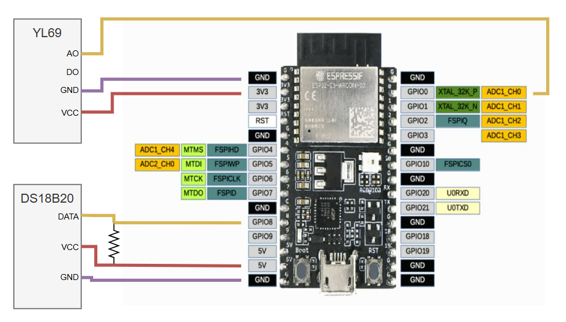

# Sistema de monitoreo y gestión remota de invernaderos - Sensor
Proyecto realizado dentro del marco del Trabajo Profesional de Ingeniería Eletrónica de la Facultad de Ingeniería de la Universidad de Buenos Aires

## Contenido 
Este repositorio contiene el firmware del dispositivo de los sensores del sistema.

## Características Técnicas
- Microcontrolador: ESP32-C3-WROOM-02 de la empresa [Espressif](https://www.espressif.com/)
- Framework: ESP-IDF
- Sensor de Temperatura: DS18B20
- Sensor de Humedad: YL69

## Notas
- Para el sensado de las variables climatológicas se utilizó RTOS

## Esquemático
- 

