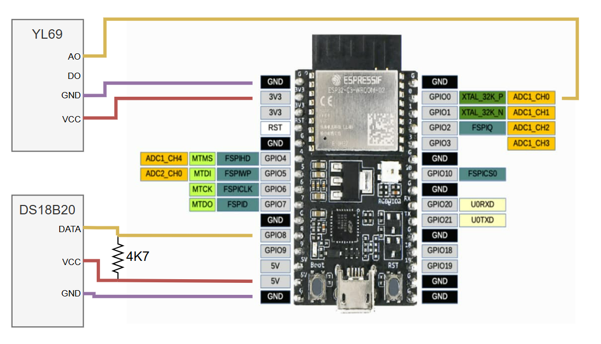

# Sistema de monitoreo y gestión remota de invernaderos 

Proyecto realizado dentro del marco del Trabajo Profesional de Ingeniería Eletrónica de la Facultad de Ingeniería de la Universidad de Buenos Aires.

## Contenido 
Este repositorio contiene el firmware, la descripción y configuración del dispositivo nodo sensor del sistema. 

Para ver la descripción completa del sistema acceder a [or-platform](https://github.com/matiasvinas/or-platform). 

## Índice
- [Nodo sensor](#nodo-sensor)
    - [Características](#características)
    - [Conexión de los sensores a la placa de desarrollo](#conexión-de-los-sensores-a-la-placa-de-desarrollo)
    - [Configuración para la comunicación BLE Mesh entre los nodos sensores y el nodo *gateway*](#configuración-para-la-comunicación-ble-mesh-entre-los-nodos-sensores-y-el-nodo-gateway)
    - [Esquemático](#esquemático)
- [Enlaces útiles](#enlaces-útiles)

# Nodo sensor

## Características
- Placa de desarrollo: ESP32-C3-WROOM-02 de la empresa [Espressif](https://www.espressif.com/).
- Framework: ESP-IDF v5.2.2.
- Sensor de temperatura DS18B20.
- Sensor de humedad del suelo YL-69.
- Reductor de tensión mini-360.
- 2 baterías HY 18650 3.7V Li-ion.
## Conexión de los sensores a la placa de desarrollo

- La salida DATA del sensor de temperatura fue conectada al GPIO 09 de la placa de desarrollo.
- La salida del divisor de tensión fue conectada al GPIO 03 de la placa de desarrollo.
- La salida analógica del sensor módulo YL-69 fue conectada al GPIO 04 de la placa de desarrollo.

## Configuración para la comunicación BLE Mesh entre los nodos sensores y el nodo *gateway*
1. Selección del stack de NimBLE:
    1. Abrir el directorio del proyecto y correr el siguiente comando:
        ```
        idf.py menuconfig
        ```
    2. Navegar a `Component Config -> Bluetooth -> Host`
    3. En `Host` seleccionar `NimBLE - BLE Only`.
    4. Guardar cambios y salir.

2. Definición de ID de la malla y de los sensores
    1. Definir `SENSOR_ID_MESH_0` y `SENSOR_ID_MESH_1` en el archivo `main/main.c` para identificar a todos los nodos que deben ser aprovisionados por el nodo *gateway*. Este ID debe coincidir con el ID definido para la malla en el [firmware del nodo *gateway*](https://github.com/matiasvinas/esp32c3-gateway).

    2. Definir un `SENSOR_ID_NODE` en el archivo `main/main.c` para cada uno de los nodos sensores. Este valor debe ser diferente en el firmware de cada uno de los nodos sensores. 
        ```
        /* los primeros 2 bytes se usan para identificar a todos los nodos de la malla*/
        /* el 3° byte se usa para distinguir cada nodo de la malla */
        #define SENSOR_ID_MESH_0                    0x32    
        #define SENSOR_ID_MESH_1                    0x10
        #define SENSOR_ID_NODE      				0x01
        static uint8_t dev_uuid[ESP_BLE_MESH_OCTET16_LEN] = { SENSOR_ID_MESH_0, SENSOR_ID_MESH_1, SENSOR_ID_NODE };
        ```

## Esquemático


# Enlaces útiles

[ESP-BLE-MESH - Sensor Server Client Example](https://github.com/espressif/esp-idf/blob/master/examples/bluetooth/esp_ble_mesh/sensor_models/sensor_client/README.md)

[ESP32 Docs - Sleep Modes ](https://docs.espressif.com/projects/esp-idf/en/stable/esp32/api-reference/system/sleep_modes.html)

[ESP32 Example - Bluetooth Power Save](https://github.com/espressif/esp-idf/blob/v5.4.1/examples/bluetooth/nimble/power_save/README.md)

[esp32c3-gateway](https://github.com/matiasvinas/esp32c3-gateway)
