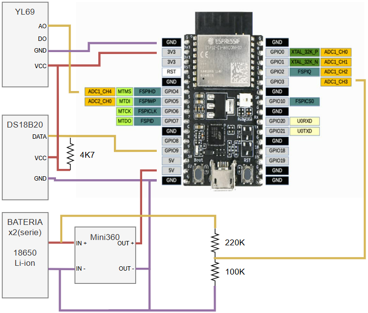

# Sistema de monitoreo y gestión remota de invernaderos - Sensor
Proyecto realizado dentro del marco del Trabajo Profesional de Ingeniería Eletrónica de la Facultad de Ingeniería de la Universidad de Buenos Aires

## Contenido 
Este repositorio contiene el firmware del dispositivo de los sensores del sistema.

## Características del Hardware
- Microcontrolador: ESP32-C3-WROOM-02 de la empresa [Espressif](https://www.espressif.com/)
- Framework: ESP-IDF
- Sensor Temperatura: DS18B20
- Sensor Humedad suelo: YL69
- Conversor Buck: Mini360
- Batería: HY 18650 3.7V Li-ion (2 unidades en serie)

## Características de Variables

### Temperatura
- Rango: -55 a +125 °C
- Precisión: +-0.5 °C en el rango de -10°C a +85°C
- Protocolo de comunicación: 1-Wire
- Tensión de Operación: 3.3 V
- Modelo: DS18B20

### Humedad
- Rango: detecta niveles de humedad del suelo desde seco hasta saturado.
- Tensión de entrada: 3.3 V
- Modelo: YL69

### Batería
- Se utiliza un divisor resistivo para poder muestrear una tensión compatible con el ADC del ESP32C3

## Comunicación de datos

### Bluetooth

El dispositivo usa Bluetooth 5.0 mediante la librería NimBLE.
El dispositivo usa Bluetooth BLE Mesh para la comunicación con el [ESP32C3-gateway](https://github.com/matiasvinas/esp32c3-gateway)

### BLE Mesh - Sensor Server Model

El "Modelo Sensor Servidor" es el modelo usado para exponer una serie de estado de sensores.
El "Modelo Cliente Servidor" es el modelo utilizado para consumir los valores de los estados expuestos por el Servidor.
El estado del sensor está compuesto por:
- Sensor Descriptor state
- Sensor Setting state
- Sensor Cadence state
- Sensor Data state
- Sensor series Column state

### Identificación del dispositivo sensor

- Cada dispositivo sensor es distinguido por su UUID de 128 bits
- Los primeros 16 bits permiten ser identificados por el dispositivo [ESP32C3-gateway](https://github.com/matiasvinas/esp32c3-gateway) y ser provisionados por el mismo.
- Los siguientes 8 bits permiten a los dispositivos sensor distinguirse del resto de los dispositivos de la familia. 
- El resto de los bits son generados de forma aleatoria por la librería BLE Mesh. 
### Algoritmo para el envío de datos

1. El dispositivo sensor recibe un GET_STATE_MESSAGE del dispositivo [ESP32C3-gateway](https://github.com/matiasvinas/esp32c3-gateway).
2. El dispositivo sensa y almacena el valor de temperatura.
3. El dispositivo sensa y almacena el valor de humedad.
4. El dispositivo sensa y almacena el valor de tensión de batería.
5. El dispositivo envía los valores almacenados al dispositivo [ESP32C3-gateway](https://github.com/matiasvinas/esp32c3-gateway).

## Notas
- Se modificó el archivo ble_mesh_example_init.c para poder definir de manera explícita los 8 bits que identifican al dispositivo sensor del resto, en específico la función: ble_mesh_get_dev_uuid().

## Esquemático

## Enlaces útiles

[ESP-BLE-MESH - Sensor Server Client Example](https://github.com/espressif/esp-idf/blob/master/examples/bluetooth/esp_ble_mesh/sensor_models/sensor_client/README.md)